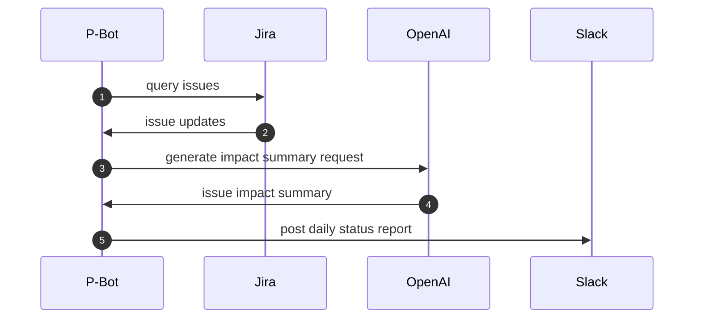

# Progress Bot

**Progress Bot** collects JIRA tickets with changed status over the given period of time and posts a slack notification with a summary.

```sh
$ make build
$ make run
```


```mermaid
sequenceDiagram
    autonumber
    P-Bot->>Jira: query issues
    Jira->>P-Bot: issue updates
    P-Bot->>OpenAI: generate impact summary request
    OpenAI->>P-Bot: issue impact summary
    P-Bot->>Slack: post daily status report
```
